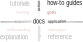

# How-to guides

by Christian Ghiaus

Researcher ID: [ORCID](https://orcid.org/0000-0001-5561-1245), [SciProfiles](https://sciprofiles.com/profile/2970335), [Scopus](https://www.scopus.com/authid/detail.uri?authorId=6603390490), [Web of Science](https://www.webofscience.com/wos/author/record/1651371), [HAL](https://cv.hal.science/cghiaus)

> Figure 1. How-to guide type of documentation (adapted after [Procida 2017](https://diataxis.fr)).

__How-to Guides__ provide directions for specific _goals_. Users follow steps to accomplish a task (_action_)
applying existing knowledge to solve particular problems (_application_).

__How-to Guides__ are goal-oriented.

- how to obtain weights for criteria (Simos')
- how to do a step-by-step ELECTRE Tri-B analysis based on base profiles
- how to do a step-by-step ELECTRE Tri-B analysis based on extreme levels of alternative  performance

# Bibliography
Procida, D. (2017). Diátaxis documentation framework. URL https://diataxis.fr.
