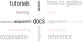

# ELECTRE Tri-B documentation: tutorials

by Christian Ghiaus 

Researcher ID: [ORCID](https://orcid.org/0000-0001-5561-1245), [SciProfiles](https://sciprofiles.com/profile/2970335), [Scopus](https://www.scopus.com/authid/detail.uri?authorId=6603390490), [Web of Science](https://www.webofscience.com/wos/author/record/1651371), [HAL](https://cv.hal.science/cghiaus)

> Figure 1. Tutorial type of documentation (adapted after [Procida 2017](https://diataxis.fr)).

__Tutorials__ are structured _learning_ experiences through a series of guided steps to solve a meaningful problem. Users actively engage with the material (_action_) aimed at helping them gain new knowledge and skills (_acquisition_).

__Contents:__

- `base_profile.ipynb`: Tutorial on ELECTRE Tri analysis with explicitely defined base profiles.

- `base_profile_pelectre.ipynb`: Tutorial on probabilsitic ELECTRE Tri analysis with explicitely defined base profiles.

- `bldg_retrofit_base.ipynb`:  Tutorial on ELECTRE Tri analysis of energy retrofit of a building using base profiles for categories.

- `bldg_retrofit_base_pelectre.ipynb`: Tutorial on probabilistic ELECTRE Tri analysis of energy retrofit of a building using base profiles for categories. 

- `bldg_retrofit_level.ipynb`: Tutorial on energy retrofit of a building using extreme levels in order to find equidistant base profiles (and, consequently, the categories).

- `simos_revised_tutorial.ipynb`: Tutorial for finding the weights of criteria.

# Bibliography
Procida, D. (2017). Diátaxis documentation framework. URL https://diataxis.fr.
