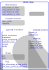

# Source code ELECTRE Tri-B and Simos modified method

by Christian Ghiaus

## Installation

This software requires no installation. Simply copy the module files to your desired location.

## Contents

- `electre-tri.py`: ELECTRE Tri-B Multiple-Criteria Decision-Making.
- `simos_revised`: Simos' method for determining weights of criteria in ELECTRE type methods.

## `electre_tri.py` module structure

Read the documentation from `/docs`.
